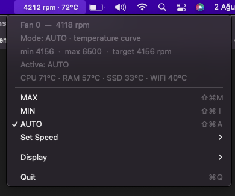

# FCM — Fan Control Menu

A lightweight **menu bar app** to control fan speed on Intel and Apple Silicon Macs.

It shows live fan RPM and temperatures in the menu bar, lets you force **MAX / MIN /
a fixed speed**, or run a **temperature-based auto curve** — useful when macOS keeps
the fan too low and the machine shuts down under load.



## Features

- Menu bar status: `rpm · °C` (choose **rpm only**, **temperature only**, or hide the icon)
- **MAX / MIN / AUTO** modes and a **Set Speed** submenu
- **AUTO** uses its own temperature curve (50–88 °C → min–max) because some models
  never spin the fan up themselves
- Watchdog keeps the target speed enforced every 1.5 s
- Works on **Intel and Apple Silicon** (Universal binaries)
- Self-installing privileged helper: asks for your password **once**, then runs
  without a terminal

## Requirements

- macOS 12+ (tested on 12.7.6)
- Intel or Apple Silicon

## Install (no terminal needed)

1. Download `FCM.app` from [Releases](../../releases) (or build it yourself with `./build.sh`)
2. Move it to `/Applications`
3. Launch it (Finder, Launchpad, or Spotlight)
4. Enter your password **once** — it installs the `com.fcm.helper` launch daemon
   and is ready to go

> If Gatekeeper complains (transferred via AirDrop/download), right-click the app
> and choose **Open**, or run:
> ```
> xattr -dr com.apple.quarantine FCM.app
> ```

## Uninstall

```
sudo launchctl unload /Library/LaunchDaemons/com.fcm.helper.plist
sudo rm -f /Library/LaunchDaemons/com.fcm.helper.plist \
           /Library/PrivilegedHelperTools/fcm-helper.sh \
           /Library/PrivilegedHelperTools/fcm-smc
rm -rf /Applications/FCM.app
```

## Build from source

Requires Xcode Command Line Tools (`xcode-select --install`).

```bash
./build.sh        # produces FCM.app (Universal)
```

## Command-line control

Without the app, you can control the fan from the terminal (`sudo` will ask for
the password on each write):

```bash
./scripts/fcm.sh status
./scripts/fcm.sh max
./scripts/fcm.sh min
./scripts/fcm.sh auto
./scripts/fcm.sh set 3000
./scripts/fcm.sh hold min     # keep asserting until Ctrl+C
```

## How it works

- The app runs as a normal user and reads the SMC directly (no root needed)
- For **writes** it sends commands to `/var/run/fcm.fifo`
- A root launch daemon (`com.fcm.helper`) reads the FIFO and writes the SMC keys
  (`F0Md`, `F0Mn`, `F0Tg`)
- While the app is running it re-asserts the target every 1.5 s
- On quit the fan is set to **MAX** as a safety net (the system may not take
  control back on some models)

## Notes

- Fan speed values (min/max/curve) are read from the SMC at runtime — no hardcoded
  machine-specific limits
- Temperature sensors are probed with fallback keys per model; sensors the machine
  doesn't expose show as `—`
- Reboot resets the SMC to the system defaults

## Disclaimer

Using this tool is entirely **your decision**. It writes directly to the SMC and
bypasses macOS fan management. If it breaks your hardware, your software, your
warranty, your day, or your trust in humanity — that's on you, not on us. Don't
hold a low fan speed forever, and don't come complaining.

## License

[MIT](LICENSE)
